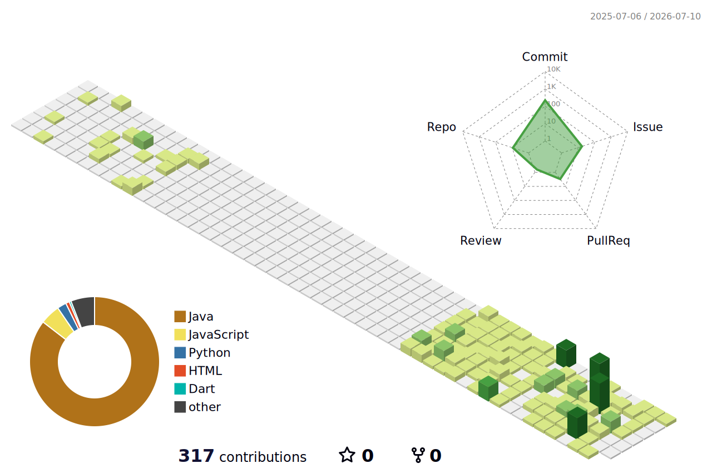

### 🎐🍶🩵💙🪼💍

### About Me

- 🌊 Building: Supabase & Database
- 📘 Learning: JavaScript, Python, Data Structures
- ⚙️ Backend & Data Handling
- 📫 iyeoseol096@gmail.com

### Links

### 🛠 Tech Stack

  
  
  
  
  
  

### 📊 GitHub Activity

